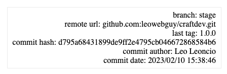

Git Info plugin for Craft
===

Output git info over twig

### Installation

Shell
```shell
composer require leowebguy/git-info -w && php craft plugin/install git-info
```

DDEV
```shell
ddev composer require leowebguy/git-info -w && ddev exec php craft plugin/install git-info
```

### Usage

`{{ craft.git.branch }}` >> current branch, i.e: stage

`{{ craft.git.remoteUrl }}` >> i.e: github.com:leowebguy/git-info.git

`{{ craft.git.lastTag }}` >> i.e: 3.1.2

`{{ craft.git.commitHash }}` >> last commit hash

`{{ craft.git.commitAuthor }}` >> last commit author (name)

`{{ craft.git.commitDate }}` >> last commit date

```twig

    <div style="position: fixed; bottom: 1rem; right: 1rem; padding: 6px 10px; text-align: right; border: solid 1px #eee; z-index: 999;">
        {{ 'branch: ' ~ craft.git.branch }}<br>
        {{ 'remote url: ' ~ craft.git.remoteUrl }}<br>
        {{ 'last tag: ' ~ craft.git.lastTag }}<br>
        {{ 'commit hash: ' ~ craft.git.commitHash }}<br>
        {{ 'commit author: ' ~ craft.git.commitAuthor }}<br>
        {{ 'commit date: ' ~ craft.git.commitDate }}
    </div>

```


